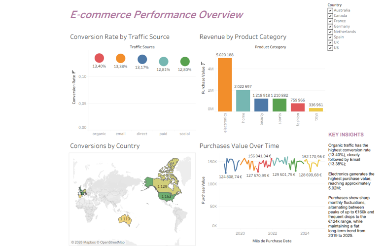

# 📊 Data Analytics Practicum Program

### Mayerfeld Consulting

Practical data analytics work completed as part of the **Data Analytics Practicum Program** with Mayerfeld Consulting, together with additional independent work applying **Python, AI, and data analytics**.

The program focused on developing practical skills in **Python, SQL, Statistics, and Tableau**, combining technical exercises with a practical case study and analytical deliverables.

In addition, I developed an independent **AI-Powered Data Dashboard & Insights App**, demonstrating the application of Python, Google AI, data analysis, and web deployment in a rapid-build project.

---

## 🛠️ Skills & Technologies

| Area | Tools & Concepts |
|---|---|
| 🐍 **Programming** | Python, Pandas |
| 🤖 **Artificial Intelligence** | Google AI, Generative AI, AI-powered insights, API integration |
| 📊 **Statistics** | Distributions, hypothesis testing, regression |
| 🗄️ **Database & Querying** | SQL, Joins, Subqueries, CTEs |
| 📈 **Visualization** | Tableau, Data Visualization, Interactive Dashboards |
| 🌐 **Web & Deployment** | Web application development, Hosting, API integration |
| 💡 **Analytics** | Data exploration, statistical analysis, analytical thinking, data-driven insights |

---

## 📂 Project Work

This repository contains practical projects completed during the **Data Analytics Practicum Program**, covering Python, SQL, statistics, and Tableau, as well as an independent AI-powered data analytics project.

- 🐍 **Python Project 1** — Python fundamentals and data analysis
- 🐍 **Python Project 2** — Statistical analysis and data exploration
- 🤖 **AI-Powered Data Dashboard & Insights App** — Python-based dashboard with Google AI integration and AI-powered insights
- 🗄️ **SQL Project** — Advanced SQL querying and data analysis
- 📈 **Tableau Dashboard** — Interactive dashboard with 4 visualizations, 1 filter, and 3 key insights

---

## 🐍 Python

The Python work focused on building practical programming and data analysis skills, from Python fundamentals and Pandas to statistical analysis and AI-powered applications.

### Topics Covered

- Python fundamentals
- Data structures
- Functions
- Pandas
- Data exploration
- Statistical analysis
- Hypothesis testing
- Regression
- Data distributions
- Data visualization
- AI integration
- API integration
- AI-powered data insights

### Files

- [`project1.ipynb`](Python/project1.ipynb)
- [`project2.ipynb`](Python/project2.ipynb)

### 🤖 AI-Powered Data Dashboard & Insights App

An independent rapid-build project developed in approximately **2 hours**, combining **Python, data analysis, dashboard development, and Google AI**.

#### Project Highlights

- 🐍 Developed using Python
- 🤖 Integrated Google AI to generate AI-powered insights
- 📊 Created a data dashboard for exploring and presenting information
- 🔌 Implemented API integration
- 🌐 Deployed the application as a live web application
- ⚡ Developed from concept to working prototype in approximately 2 hours

#### Technologies

**Python · Data Analysis · Data Visualization · Google AI · Generative AI · API Integration · Web Development · Hosting**

#### Live Demo

[View Live Application →](http://www.nadia-vaz.space/)

---

## 🗄️ SQL

The SQL exercises focused on developing the ability to work with data using increasingly advanced querying techniques.

### Topics Covered

- Joins
- Subqueries
- Common Table Expressions (CTEs)
- Query performance
- SQL best practices
- Data analysis using SQL

### File

- [`project3.sql`](SQL/project3.sql)

---

## 📈 Tableau

The Tableau work focused on developing an interactive dashboard to communicate findings through data visualization.

### Dashboard Features

- 📊 4 visualizations
- 🔎 1 interactive filter
- 💡 3 key insights

### Dashboard Preview

### Interactive Dashboard

[View Dashboard →](https://public.tableau.com/app/profile/n.dia.vaz/viz/hm_4_project_NdiaVaz/Homework4?publish=yes)

---

## 📚 Key Takeaways

Through the practicum and additional independent projects, I strengthened my ability to:

- Work with data using Python and SQL
- Explore and interpret datasets
- Apply statistical concepts to data analysis
- Write advanced SQL queries
- Create interactive data visualizations
- Build dashboards in Tableau
- Integrate AI into data applications
- Work with APIs and AI services
- Generate AI-powered data insights
- Deploy web-based data applications
- Identify and communicate data-driven insights
- Approach analytical problems in a structured way
- Rapidly develop functional data applications from concept to prototype

---

## 🔒 Project Notes

The datasets provided for the practical case study are **not publicly shared**, in accordance with the project requirements.

This repository therefore focuses on the skills, technical exercises, and publicly shareable work developed during the program.

The **AI-Powered Data Dashboard & Insights App** is an independent project and is included to demonstrate additional practical experience with **Python, AI integration, data visualization, and web deployment**.

---

## 👩‍💻 About Me

I am a **Mathematics graduate** interested in applying mathematical and analytical thinking to real-world data problems.

Through the Data Analytics Practicum Program and independent projects, I have developed practical experience with **Python, SQL, Statistics, Tableau, and AI-powered data applications**, strengthening my foundation in Data Analytics and expanding my ability to apply AI to real-world analytical problems.
